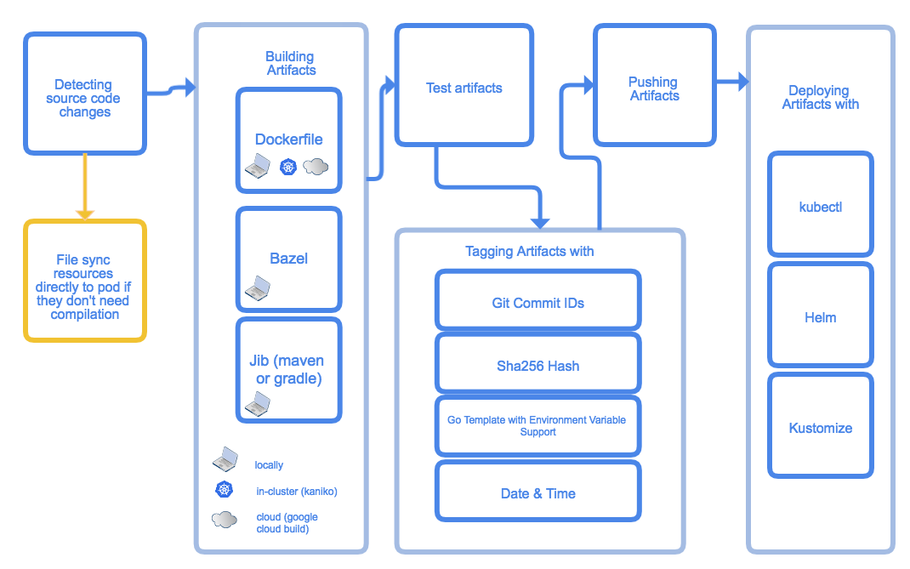

# Skaffold

https://skaffold.dev/docs/



## Install

```bash
curl -Lo skaffold https://storage.googleapis.com/skaffold/releases/latest/skaffold-linux-amd64
chmod +x skaffold
sudo mv skaffold /usr/local/bin
```

## Setup a registry

- flag: `skaffold dev --default-repo <myrepo>`
- env var: `SKAFFOLD_DEFAULT_REPO=<myrepo> skaffold dev`
- global skaffold config (one time): `skaffold config set --global default-repo <myrepo>`
- skaffold config for current kubectl context: `skaffold config set default-repo <myrepo>`

## Main commands

- `skaffold dev` : will monitor your code repository and perform a Skaffold workflow every time a change is detected. 
`skaffold.yaml` provides specifications of the workflow, which is for example :

  - Collects and watches your source code for changes
  - Syncs files directly to pods if user marks them as syncable
  - Builds artifacts from the source code
  - Tests the built artifacts using container-structure-tests
  - Tags the artifacts
  - Pushes the artifacts
  - Deploys the artifacts
  - Monitors the deployed artifacts
  - Cleans up deployed artifacts on exit (Ctrl+C)

- `skaffold run` : will build and deploy your app once, on demand

## Skaffold configuration file

https://skaffold.dev/docs/references/yaml/